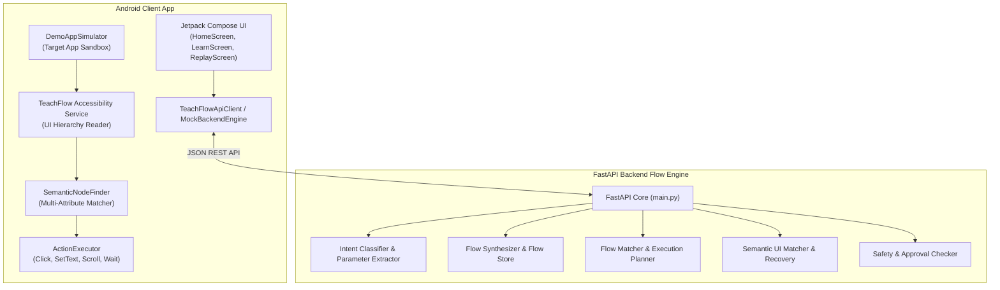
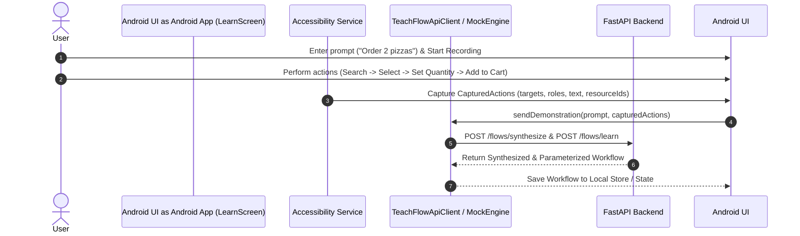
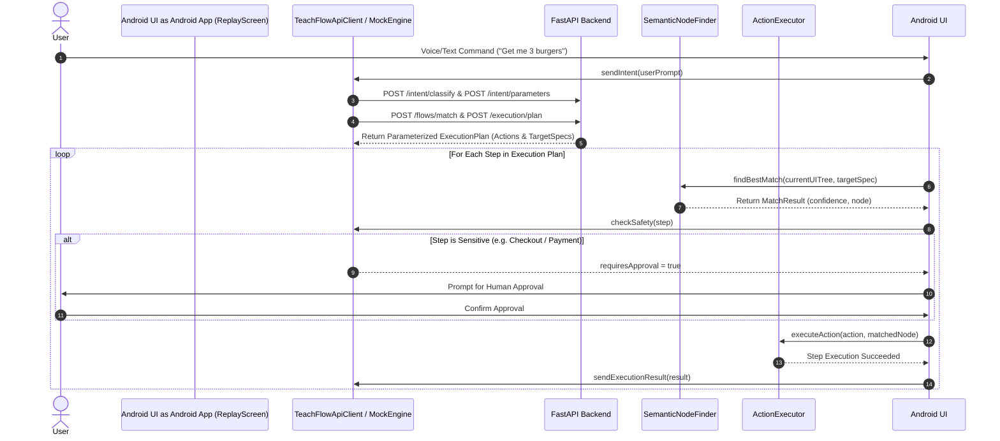

# 🚀 TeachFlow AI: Teachable & Semantic Android Automation Engine

TeachFlow AI is an end-to-end AI automation system designed to **record, synthesize, match, and replay Android UI workflows** using **semantic element matching** instead of brittle screen coordinates. It combines an **Android Jetpack Compose application & Accessibility Service** with a **FastAPI backend engine** and an **offline Mock Engine simulator**.

---

## 🌟 Key Features

- 🎙️ **Natural Language Intent & Parameter Extraction**: Classifies user commands like *"Order 2 pizzas"* or *"Get me 3 burgers"* into structured parameterized workflows (`ORDER_FOOD(item, quantity)`).
- 🔍 **Coordinate-Free Semantic UI Matching**: Resolves target UI elements across layout variations, screen sizes, and text changes using text, content description, resource IDs, hierarchy context, and accessibility attributes ([`SemanticNodeFinder`](file:///c:/Users/sanja/OneDrive/Desktop/TeachFlow-AI/android/TeachFlow/app/src/main/java/com/teachflow/ai/executor/SemanticNodeFinder.kt)).
- 🤖 **Demonstration-Based Workflow Learning**: Captures user interactions (*Search → Select Item → Set Quantity → Add to Cart*) and synthesizes reusable, parameterized workflow templates.
- 🛡️ **Human-in-the-Loop Safety Engine**: Automatically detects sensitive checkpoints (Checkout, Payment, Login, PINs, OTPs) and enforces explicit human approval before proceeding.
- 📱 **Embedded Demo Simulator & Jetpack Compose UI**: Built-in interactive simulator ([`DemoAppSimulator`](file:///c:/Users/sanja/OneDrive/Desktop/TeachFlow-AI/android/TeachFlow/app/src/main/java/com/teachflow/ai/ui/components/DemoAppSimulator.kt)) and approval UI ([`HomeScreen.kt`](file:///c:/Users/sanja/OneDrive/Desktop/TeachFlow-AI/android/TeachFlow/app/src/main/java/com/teachflow/ai/ui/screens/HomeScreen.kt)) for offline testing and demonstration.
- ⚡ **Dual Execution Modes**: Seamlessly switch between live FastAPI REST endpoints and local offline [`MockBackendEngine`](file:///c:/Users/sanja/OneDrive/Desktop/TeachFlow-AI/android/TeachFlow/app/src/main/java/com/teachflow/ai/network/MockBackendEngine.kt).

---

## 🏗️ System Architecture



---

## 🔄 Workflow Execution Pipeline

### 1. 🎓 Learn Mode (Demonstration & Synthesis)



### 2. ⚡ Replay Mode (Execution & Safety Approval)



---

## 📁 Repository Structure

```text
TeachFlow-AI/
├── android/
│   └── TeachFlow/
│       ├── app/
│       │   ├── src/main/java/com/teachflow/ai/
│       │   │   ├── accessibility/      # TeachFlowAccessibilityService & UIHierarchyReader
│       │   │   ├── executor/           # ActionExecutor & SemanticNodeFinder
│       │   │   ├── model/              # UITree, TargetSpec, Workflow, ExecutionResult
│       │   │   ├── network/            # TeachFlowApiClient, MockBackendEngine, WorkflowStore
│       │   │   └── ui/                 # Jetpack Compose UI, HomeScreen, DemoAppSimulator
│       │   └── src/test/java/          # Android Unit Test Suite (20 tests)
│       ├── build.gradle.kts
│       ├── settings.gradle.kts
│       └── gradlew.bat
├── backend/
│   ├── app/
│   │   ├── executor/                   # Execution planning & safety checkers
│   │   ├── flow/                       # Workflow synthesis, matching & JSON store
│   │   ├── intent/                     # Intent classification & parameter extraction
│   │   ├── models/                     # Pydantic schemas & JSON contracts
│   │   ├── semantic/                   # UI element matching & recovery algorithms
│   │   └── main.py                     # FastAPI application routes
│   ├── data/                           # Local workflow persistence (workflows.json)
│   ├── tests/                          # Automated backend regression test suite (60 tests)
│   └── requirements.txt
├── shared/
│   └── schemas/                        # Shared JSON schema definitions (workflow, execution)
├── docs/
│   ├── api_contract.md                 # Implemented REST API specifications
│   └── android_build_limits.md         # Environment & build documentation
└── scripts/
    └── evaluate_flow_engine.py         # Flow engine evaluation suite
```

---

## 🔌 Backend API Specification

| Method | Endpoint | Description |
| :--- | :--- | :--- |
| `GET` | `/health` | Service health status check |
| `POST` | `/intent/classify` | Classify natural language text into intent categories |
| `POST` | `/intent/parameters` | Extract item, quantity, and target parameters |
| `POST` | `/flows/synthesize` | Synthesize parameterized workflow from text steps |
| `POST` | `/flows/learn` | Store a refined semantic workflow definition |
| `GET` | `/flows` | List all learned workflows |
| `GET` | `/flows/{flow_id}` | Retrieve specific workflow definition |
| `DELETE` | `/flows/{flow_id}` | Delete a stored workflow |
| `POST` | `/flows/match` | Match command text to a learned `flow_id` |
| `POST` | `/execution/plan` | Generate bound parameter execution plan |
| `POST` | `/ui/match` | Match target specification against current accessibility tree |
| `POST` | `/ui/recover` | Attempt fallback UI element recovery |
| `POST` | `/safety/check` | Detect sensitive actions requiring human approval |
| `POST` | `/execution/result` | Validate step execution report |

For complete payload samples and error response models, see [`docs/api_contract.md`](docs/api_contract.md).

---

## 🛠️ Setup & Running

### Prerequisites
- Python 3.11+
- Java JDK 17
- Android SDK 34 (Android Studio)

### 1. Python FastAPI Backend

From the repository root:

```powershell
# Install backend dependencies
python -m pip install -r backend/requirements.txt

# Start FastAPI dev server
python -m uvicorn backend.app.main:app --reload
```

- Server: `http://127.0.0.1:8000`
- Interactive OpenAPI Docs: `http://127.0.0.1:8000/docs`

### 2. Android Application

From `android/TeachFlow`:

```powershell
# Build debug APK
.\gradlew.bat assembleDebug --no-daemon

# Run Android unit tests
.\gradlew.bat test --no-daemon
```

Compiled APK output path:
[`android/TeachFlow/app/build/outputs/apk/debug/app-debug.apk`](file:///c:/Users/sanja/OneDrive/Desktop/TeachFlow-AI/android/TeachFlow/app/build/outputs/apk/debug/app-debug.apk)

---

## 🧪 Verification & Test Suite

The repository features comprehensive automated test coverage:

- **Backend Pytest Regression**: **60 PASSED** (`$env:PYTHONPATH="." ; python -m pytest backend/tests`)
- **Android Unit Test Suite**: **20 PASSED** (`.\gradlew.bat :app:testDebugUnitTest --no-daemon`)
  - [`SemanticNodeFinderTest`](file:///c:/Users/sanja/OneDrive/Desktop/TeachFlow-AI/android/TeachFlow/app/src/test/java/com/teachflow/ai/SemanticNodeFinderTest.kt) (Resource ID & text matching verification)
  - [`ActionModelSerializationTest`](file:///c:/Users/sanja/OneDrive/Desktop/TeachFlow-AI/android/TeachFlow/app/src/test/java/com/teachflow/ai/ActionModelSerializationTest.kt)
  - [`MockBackendEngineTest`](file:///c:/Users/sanja/OneDrive/Desktop/TeachFlow-AI/android/TeachFlow/app/src/test/java/com/teachflow/ai/MockBackendEngineTest.kt)
  - [`UIHierarchyReaderTest`](file:///c:/Users/sanja/OneDrive/Desktop/TeachFlow-AI/android/TeachFlow/app/src/test/java/com/teachflow/ai/UIHierarchyReaderTest.kt)
  - [`WorkflowExecutionTest`](file:///c:/Users/sanja/OneDrive/Desktop/TeachFlow-AI/android/TeachFlow/app/src/test/java/com/teachflow/ai/WorkflowExecutionTest.kt)
